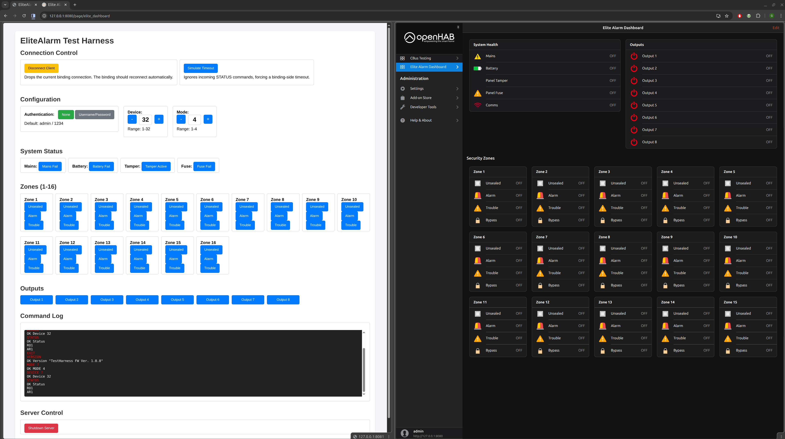

# EliteAlarm Test Harness

This test harness emulates an EliteAlarm control panel for testing the openHAB binding without requiring a physical device.

It consists of two parts:

- A TCP server that listens on port 9000 and communicates with the binding.
- A web-based UI that allows you to control the state of the simulated alarm panel.

## How to Use

### Setup the Environment

Use `rebuild_elitealarm.py` to setup corresponding things and items in a test instance of OpenHAB, for use in conjunction with `server.py`

Modify `config.json` to suit your local environment. You will need to generate a API token within the OpenHAB application. Example config as follows:

```json
{
    "OH_URL": "http://localhost:8080/rest",
    "API_TOKEN": "oh.setup1.XYQAxFVVrrP7oCK0VyZGzfbe91W4KX1V6GrfDpZTRWRKBYWgJZNrOYm64eiT0zcd5qaPOLIAn10cREjgWCw"
}
```

### Run the Server

Navigate to the `test_harness` directory in your terminal and run the server:

```bash
python3 server.py
```

This will start the TCP server on port 9000 and the web server on port 8081.

### Configure the Binding

In openHAB, configure the EliteAlarm bridge to connect to the test harness:

- **Host:** `127.0.0.1`
- **Port:** `9000`

### Control the Simulation

Open your web browser and go to `http://localhost:8081`.
From this page, you can:

- Set the authentication mode (no auth or username/password).
- Simulate system status changes (mains fail, battery fail, etc.).
- Simulate zone status changes (sealed, unsealed, alarm, tamper).
- Perform Edge Case/Negative testing (Oversized packet, empty packet, unterminated packet).

Any changes you make in the web UI will be sent to the openHAB binding over the TCP connection.
Open the Main UI page in OpenHAB "Elite Alarm Dashboard" created by `rebuild_elitealarm.py` and you can then view the test harness and OpenHAB states side-by-side as follows:



## Extending the Harness

This is a basic implementation. You can extend it by:

- Adding controls for Areas and Outputs in `index.html`.
- Expanding the API in `server.py` to handle these new controls.
- Adding more detailed and unsolicited messages to be sent to the binding to simulate a real panel more closely.
